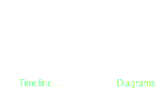

# How to contribute
$$\text{\textbf{Contribution}, \textit{noun}}$$
$$\text{"Something that you contribute or do to help produce or achieve something together with other people,}$$
$$\text{or to help make something successful."}$$

Contribution to the HOLP repository is permitted to _anyone_, as far as the rules allow. One of the main goals of an open-source project is the collaboration between peers. To collaborate effectively and painlessly, please keep an adult and civil tone.

To get started, fork the repository first.

## Translating

      

There are two ways you can contribute translations to HOLP. The first one is the less tedious method and suggested one. The second one makes use of some Python scripts located in the `Scripts` directory. You may ignore the below indications as long as the result is the same: a newly translated `.drawio` diagram that is almost identical to the original English version, that follows these rules.
* The translated diagram must be located inside the `Diagrams` directory.
* The diagram must be suffixed with a [ISO 639-2](https://en.wikipedia.org/wiki/List_of_ISO_639_language_codes) 3-letter language code.
* The translated diagram must look as similar to the original version as possible.

Example: Mark decides he wants to contribute to the repository with an Italian translation. He clones the repository and starts working on a copy of the original diagram. When he's finished, he cleans up and saves the newly translated diagram with the following name: `Timeline-ITA.drawio`. He will later submit a pull request for evaluation and approval.

### Method 1: copy original and move to folder
1. Save a copy of the original English version `Diagrams/Timeline.drawio` and name it using the `Diagrams/Timeline-ABC.drawio` convention, where `ABC` represents the 3-letter code of the target language.
2. Translate relevant text in the diagram, move cards around to make space if needed, scale and resize images if needed.
3. Save the changes and push them to your forked repository.
4. Submit a pull request on GitHub.

### Method 2: extract text and translate
1. Run `Scripts/extract.py` to extract a JSON file containing the text to be translated. This mostly includes cards, image captions and similar.
2. Modify the JSON file by translating text into your desired language.
3. When finished, run `Scripts/update.py` to create a new diagram using your newly created translation.
4. Submit a pull request on GitHub.

Of course, you can also suggest corrections to translations using the "Issues" tab from the repository's home page. Simply add the "translation" label to your issue and submit away.
