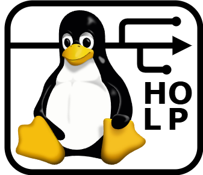

# History Of Linux Project

      
    
      
    
    
    
     
    <i>how the Linux kernel came to be,</i>  
    <i>from its origins till today</i>

---

Timeline (<i>click here to expand</i>)

 

---

## What is HOLP
__History Of Linux Project__ (HOLP) is an open-source initiative, and future 
[cultural association](https://it.wikipedia.org/wiki/Associazionismo_culturale), aimed at illustrating the 
history of Linux by using a timeline with colorful cards and images. Each card in the diagram 
represents a core event in history that contributed to the creation of Linux and to what Linux 
is, today. Images placed above the timeline illustrate important figures, 
logos belonging to companies or organizations that helped directly or passively with the 
creation of Linux.

Visit the [releases page](https://github.com/MarkGotLasagna/holp/releases) to download the latest version.

Visit the [website](https://markgotlasagna.github.io/holp/) for an interactive version. (WIP)

## Goals
1. Illustrate how Linux came to be, from its birth till present day.
2. Preserve the history of the Linux kernel's development.
3. Be a de facto academic resource for teaching Linux's history.
4. Raise awareness of the open-source initiative.

## How to contribute
HOLP is an open-source project. As such, it welcomes volunteers to:
- add, remove or modify cards about historical events;
- fact check written information, including both cards and dates;
- suggest artistic changes to the timeline; 
- enhance accessibility and readability;
- add translations.

If you'd like to contribute to this project, please read the [contribution guidelines](https://github.com/MarkGotLasagna/holp/wiki/Contribution-guidelines) document first. 
All contributors will be credited below.

---
$$—\ Contributors\ —$$
$$\small{\text{This section is currently empty.}}$$
<!--  -->